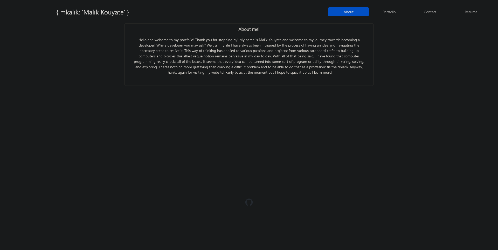

# react portfolio

## Table of Contents:
[description](#desc)

[Installation](#1)

[Usage](#2)

[Credits](#3)

[License](#4)

[Contributing](#5)

[Tests](#6)

[Questions](#7)

# 
## 0.Description:
a portofolio created via react components. Still a work in progress.

# 
## 1.Installation:
none
# 
## 2.Usage:
Considering this is my portfolio I cant recccomend others use it. However if youd like to use it as a template, be my guest, just provide credit where its due.
# 
## 3.Credits:
mkalik
# 
## 4.License:
https://opensource.org/licenses/MIT
# 
## 5.How to contribute:
none
# 
## 6.Tests:
none
# 
## 7.Questions:
Please contact me here [github](https://github.com/mkalik)
